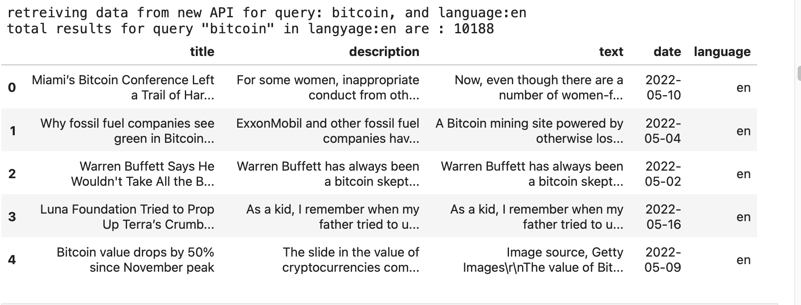
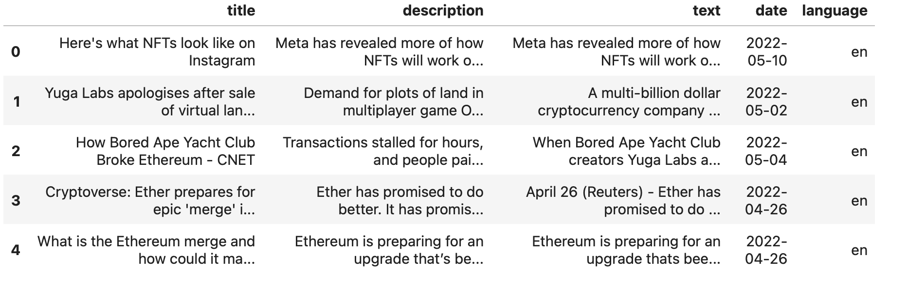
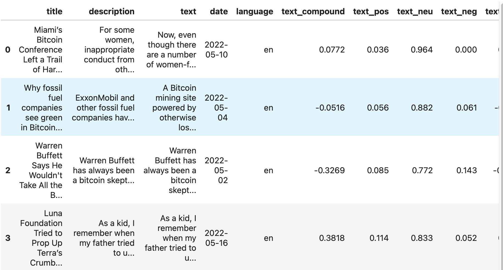
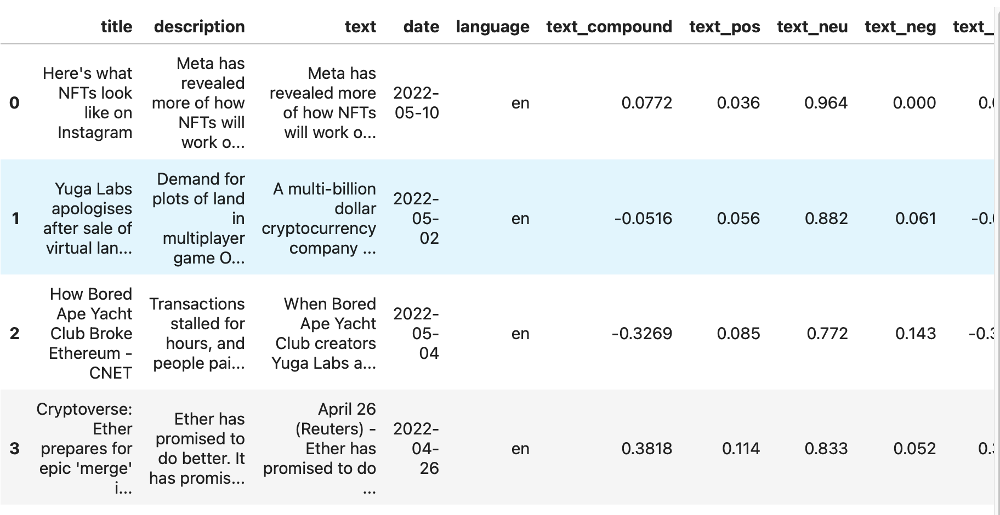
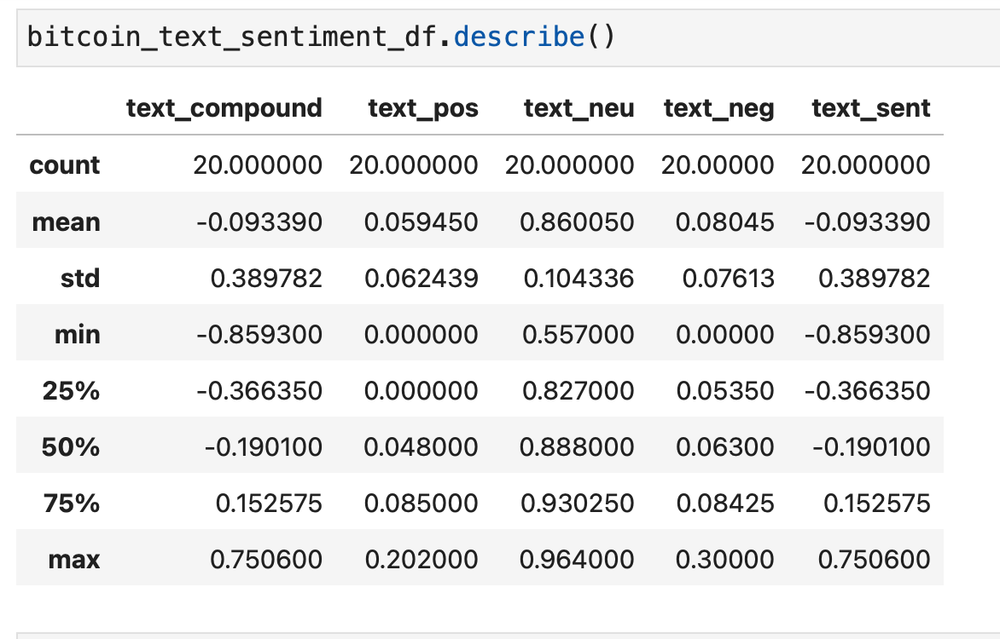
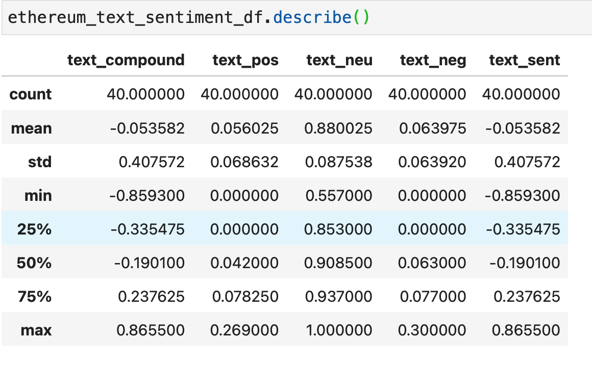
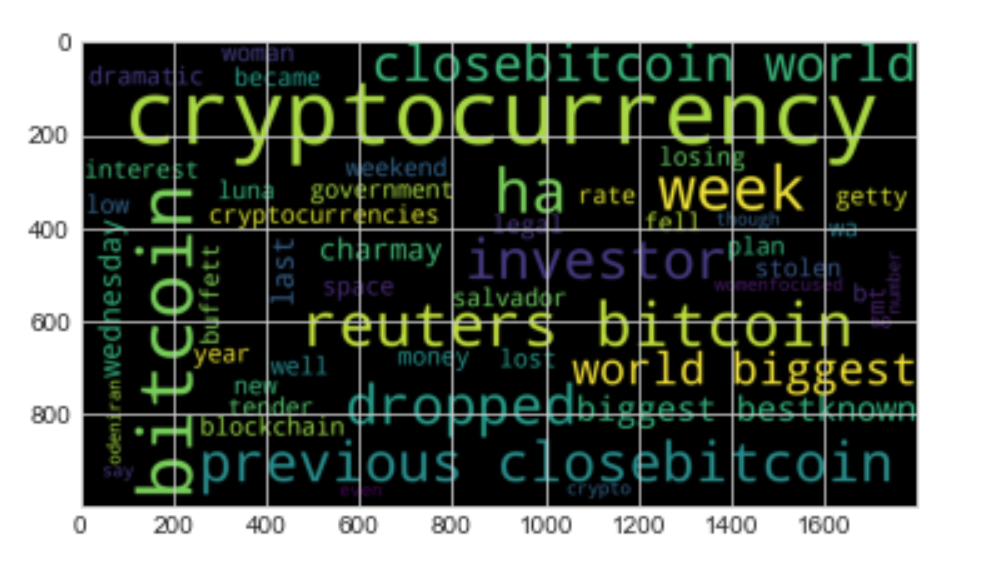
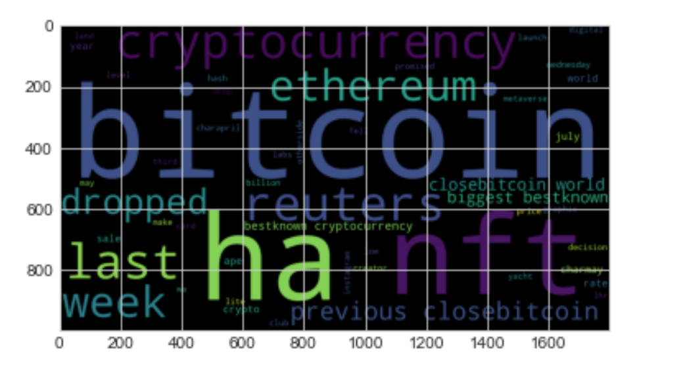
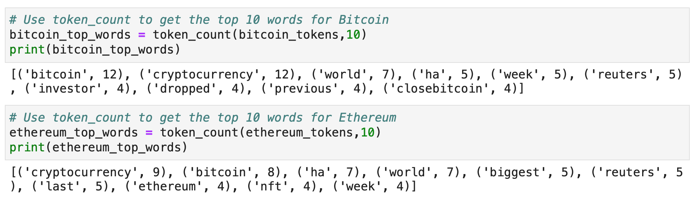
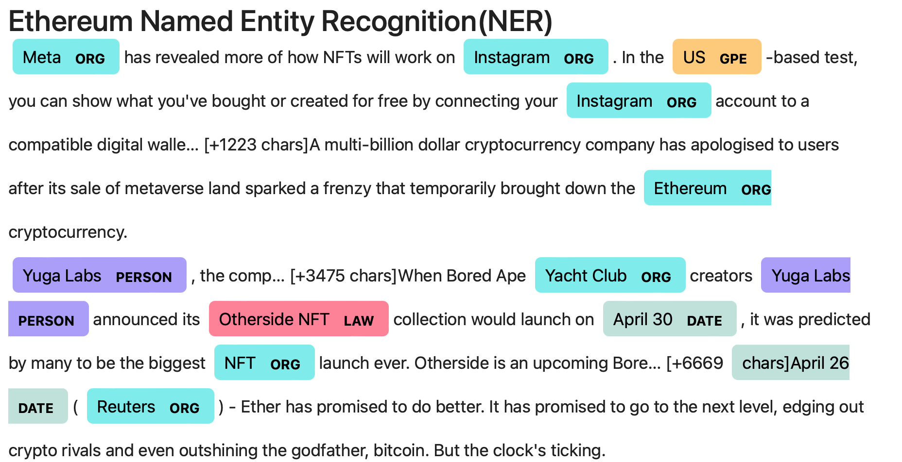

# Unit 12—Tales from the Crypto

## Background

Apply natural language processing to understand the sentiment in the latest news articles featuring Bitcoin and Ethereum. 
Apply fundamental NLP techniques to better understand the other factors involved with the coin prices such as common words and phrases and organizations and entities mentioned in the articles.

### 1 - Sentiment Analysis

Used the [newsapi](https://newsapi.org/) to pull the latest news articles for Bitcoin and Ethereum and created a DataFrame of sentiment scores for each coin.

***Bitcoin News***

***Ethereum News***

***Bitcoin Sentiment score dataframe***

***Ethereum Sentiment score dataframe***

***Bitcoin Sentiment score summary***

***Ethereum Sentiment score summary***

Answer the following questions:

> Which coin had the highest mean positive score?
***Bitcoin has the hightest mean positive score of 0.059450***
> Which coin had the highest negative score?
***Both coins has same hightest negentive score of 0.30000***
> Which coin had the highest positive score?
***Ethereum has the highest positive score of 0.269000***

### 2 - Natural Language Processing

Use NLTK and Python to tokenize text, find n-gram counts, and create word clouds for both coins. 

#### Tokenize
1. Lowercased each word.
2. Removed punctuation.
3. Removed stop words.

***Bitcoin Word Cloud***

***Ethereum Sentiment score summary***

#### N-grams

Checked the ngrams and word frequency for each coin.

1. Use NLTK to produce the ngrams for N = 2.
2. List the top 10 words for each coin.

#### Word Clouds

Generated word clouds for each coin to summarize the news for each coin.

***Bitcoin Word Cloud***

***Ethereum Word Cloud***

***Bitcoin and Ethereum Top Words***

### 3 - Named Entity Recognition

Build a named entity recognition model for both coins and visualize the tags using SpaCy.

***Bitcoin NER***

***Ethereum NER***

